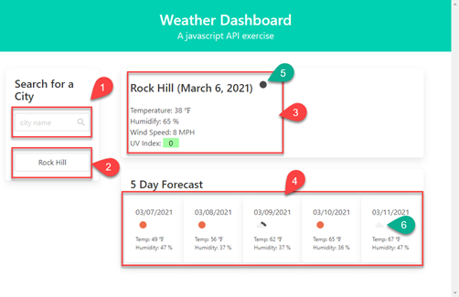

# 06-Third-Party-APIs-Weather 
Due Date: 3/6/2021 @ 11:59 PM
Coding Bootcamping assigned #6 - Third party APIs / Weather

# Objectives
The primary objectives of this exercise were to demonstrate the following:

* use of third party API
* use of styling framework (Bumla)
* DOM manipulation
* DOM traversing
* dynamic HTML from Javascript
* local storage

# References / Resources 

|Description|Link|
|-----------|----|
|Template literals|https://developer.mozilla.org/en-US/docs/Web/JavaScript/Reference/Template_literals|
|How i learned to create the alert popup|https://www.youtube.com/watch?v=JaMCxVWtW58|
|openweathermap api|https://openweathermap.org/|

# Screenshots
### Screen 1: **Initial Screen**

This is a simple Weather API exercise.  The default city that is shown is Rock Hill.
### Screen 2: **Basic Features**

1. search box
2. search history
3. current weather area
4. 5 day forecast area
5. Note: this is the CURRENT WEATHER icon, so depending on the time of day this icon might be from the day icon set of the night icon set.
6. Note: all icons used in the 5 day forcast are from the day icon set.

### Screen 3: **Search History functionality**

7. when the user enters a search into the search box, it is executed when the ENTER key is pressed.  The search is performed and also saved to the search history area.

### Screen 4: **openweathermap returns proper capitalization of city names**

8. an interesting observation of the openweathermap.org api is that it will return a properly formatted string name of the city whose weather is being searched.  For example, here we type in all lower case "fort mill"

### Screen 5: **openweathermap capitalization and pushing search history**

9. the search is executed and we will display the properly capitalized city name.  Notice also that the search order is pushed down in an intuitive manner.

### Screen 6: **actions performed when clicking on search history**

10. the button class in bulma stylized the mouse pointer to the finger.  When the user clicks on this button:

### Screen 7: **actions performed when clicking on search history (continued)**

11. we will perform the search, and pop the searched city to the top of the stack perserving a logical sort order.  Buttons are pushed down in the interface in an intuitive fashion.

### Screen 8: **Maximum number of searches**

12. The interface will preserve the 5 most recent historical searches.  This is a tunable parameter via `maxSearchHistory`.

### Screen 9: **Maximum number of searches (continued)**

13. When we execute a search for a 6th city, we will truncate the history shoing on the more recent 5 searches.

### Screen 10: **Error handling**

14. Some basic error catching is performed.  When the API call returns with an error code, there has been an invalid city name used in the search.

### Screen 11: **Error popup in action**

15. We will pop a small alert indicating that a search was attempted but that failed.  This alert will be present for 3 seconds and then disappear automatically.

### Screen 12: **After 3 seconds the Error popup is removed**

16. After 3 seconds, the interface returns to a normal state.

### Screen 13: **Responsive design thanks to Bulma**

* the application is a basic responsive application, resizing and reformatting for smaller screen sizes.

## Links
* This repo is located [on github](https://github.com/jonesjsc/06-Third-Party-APIs-Weather)
* This site is deployed on [github pages](https://jonesjsc.github.io/06-Third-Party-APIs-Weather/)

## License
* 

## Fun Stats
* 
* 